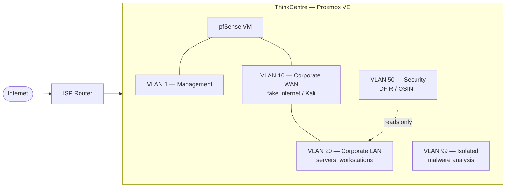

# Chapter 1 - Introduction & Planning

## Purpose

I wanted a sandbox where I could actually break things on purpose. The spark was a mix of TryHackMe and Metasploitable2 in particular, a university networking course that had me digging into subnetting and routing for the first time, and a general curiosity to run infrastructure I fully control.

The plan from day one: a Kali box attacking targets across a segmented network, a firewall doing real work between the segments, and a defender side doing its thing.

## Hardware

Deliberately cheap (or not, rent is high...)

| Component | Spec |
|---|---|
| Host | Lenovo ThinkCentre M710q Tiny |
| CPU | Intel Core i5-7500T |
| RAM | 16 GB DDR4 |
| Storage | 256 GB SSD |
| NIC | 1x onboard Ethernet |
| Hypervisor | Proxmox VE |
| Cost | ~€130 |

## Architecture

## Roadmap

The lab is organized in roughly two phases:

1. **Foundation chapters**: getting Proxmox installed, the network planned and segmented, VLANs live, and core tooling (firewall, VPN access) working.
2. **Exercise chapters**: experiments and exercises that test out functionalities of the lab and the most exciting part of the lab.

## What's next

[Chapter 2](Docs/02_infrastructure.md) covers the network design: which VMs and services I wanted, and how the VLAN segmentation was planned out before any of it was built.