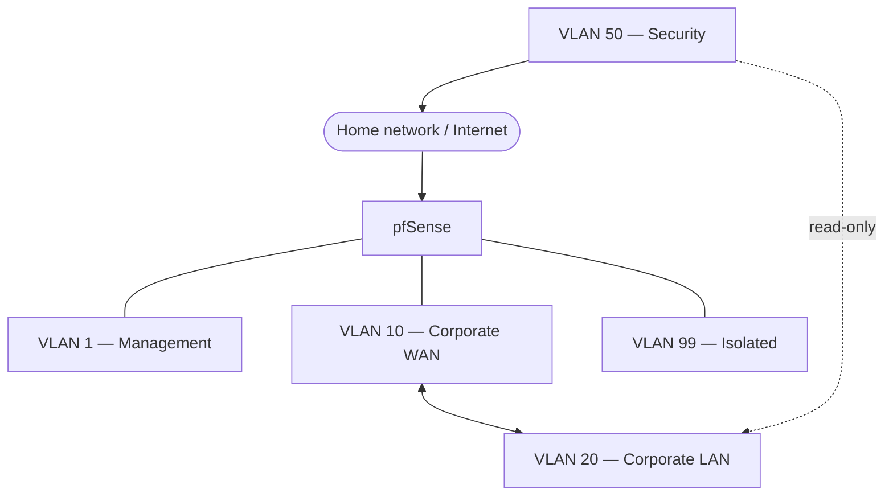

# Chapter 2 - Infrastructure: Network, Firewall & VPN

## Purpose

A lab is only as good as the walls between its rooms. Before any attacking or defending could happen, I needed real segmentation.

## Network design

Five VLANs, each with one job:

| VLAN | Name | Role |
|---|---|---|
| 1 | Management | Access to the pfSense GUI, nothing else |
| 10 | Corporate WAN ("fake internet") | Where Kali lives: the attacker's playground |
| 20 | Corporate LAN | The targets: servers, workstations |
| 50 | Security | DFIR / OSINT tooling, watches the corporate network, has real internet access |
| 99 | Isolated | Malware analysis, completely sealed off from everything |

The rule of thumb: the attacker (VLAN 10) can only ever reach the target (VLAN 20), the target can't reach out to anything real, the security team (VLAN 50) can look but not touch, and the isolation network (VLAN 99) doesn't talk to anyone. Everything is deliberately boxed in so a mistake stays a mistake instead of becoming a real incident.

## Firewall - pfSense

pfSense runs as a VM inside Proxmox rather than on dedicated hardware. It is the thing actually enforcing the table above, every VLAN gets its own interface and its own rule set, and the defaults are "deny," not "allow."

The interesting part wasn't drawing the VLAN diagram, it was getting pfSense to actually behave: making sure isolated stays isolated, that the "fake internet" VLAN genuinely has no path to the real one, and that the security VLAN can read without being able to write. Getting the outbound NAT rules right so each VLAN routes exactly where it's supposed to (and nowhere else) took a few iterations.

## Remote access - WireGuard VPN

Wanted to reach the lab without being physically home.

Chased it through a few dead ends (port forwarding, DMZ, MTU tweaks) before realizing the real issues were stacked on top of each other: the VPN tunnel had never actually been assigned as a proper firewall interface, so none of the rules I thought I was applying were doing anything and separately, the storage backing the whole VM had quietly filled up, pausing pfSense entirely at the worst possible moment. Getting through each obstacle gives a rush like nothing else.

## Lessons learned

- Segmentation is easy to draw and not so easy to actually enforce correctly
- Always check whether a rule is even being applied before assuming it's wrong
- Infrastructure problems love to hide behind other infrastructure problems (looking at you disk space)
- Workarounds are sometimes the actual answer

## What's next

Exercises and experiments where I try to test stuff, make VMs interact with each other, break stuff, simulate attacks, fix stuff etc. The order does not matter but I will list the difficulty of each one in the beginning.