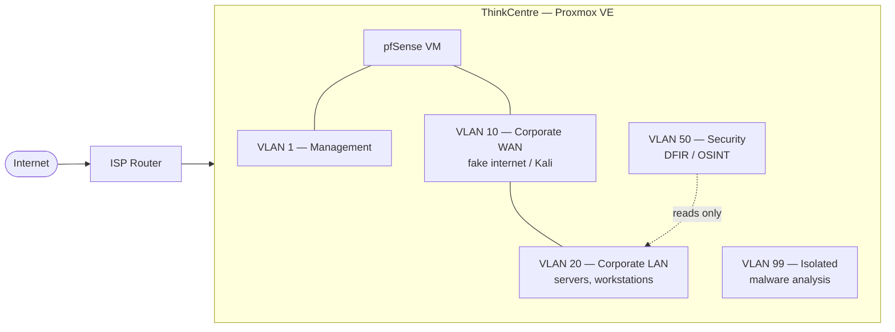

# ToasterLab

A home lab for hands-on blue team / red team practice, networking, and much more.

## Purpose

I wanted a sandbox where I could actually break things on purpose. The spark was a mix of TryHackMe and Metasploitable2 in particular, a university networking course that had me digging into subnetting and routing for the first time, and a general curiosity to run infrastructure I fully control.

The plan from day one: a Kali box attacking targets across a segmented network, a firewall doing real work between the segments, and a defender side doing its thing.

## Hardware

Deliberately cheap (or not, rent is high...)

| Component | Spec |
|---|---|
| Host | Lenovo ThinkCentre M710q Tiny |
| CPU | Intel Core i5-7500T |
| RAM | 16 GB DDR4 |
| Storage | 256 GB SSD |
| NIC | 1x onboard Ethernet |
| Hypervisor | Proxmox VE |
| Cost | ~€130 |

## Architecture at a glance

pfSense runs as a VM alongside everything else rather than as a dedicated bare-metal box with reasons to that.

## Chapters

| # | Chapter | Content |
|---|---|---|
| 1 | [Introduction & Planning](docs/01-introduction.md) | Motivation, hardware, roadmap |
| 2 | [Network Design & VLANs](docs/02-network.md) | Segmentation plan, VLAN table, temp-internet-access pattern |
| 3 | [Firewall — pfSense Setup](docs/03-firewall-pfsense.md) | Bridges vs. virtual NICs, interface assignment, firewall rules per VLAN |
| 4 | [Remote Access — WireGuard VPN](docs/04-vpn-wireguard.md) | Tunnel |

More in progress...

## Status

Actively growing with passion :)
